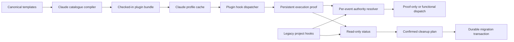

# Design: Native Claude Code plugin delivery

**Related**: [Feature spec](./spec.md) | [Test definitions](./test-definitions.md) | [Executable scenarios](../../../features/native-claude-plugin.feature)

## Architecture

Safeword will add a native Claude delivery adapter beside the existing Codex
adapter. Canonical workflow and runtime sources remain in
`packages/cli/templates/`; a deterministic catalogue compiler selects the
Claude-capable assets, rewrites project-relative references to
`${CLAUDE_PLUGIN_ROOT}`, verifies transitive closure and invocation-name
uniqueness, and emits the complete checked-in `plugin/` tree. Claude executes
that cache-local tree directly with Bun. Project state stays in `.safeword/`
and the configured namespace root.

Lifecycle follows Expand -> Prove -> Contract. Profile installation first
converges the official marketplace plugin without touching the project.
SessionStart or UserPromptSubmit then records exact cache-root execution proof
in `${CLAUDE_PLUGIN_DATA}`. Until proof is current, each viable legacy project
hook remains functionally authoritative and the plugin hook is proof-only.
Explicit cleanup removes only fingerprinted legacy assets through the same
durable transaction primitive used by Codex; once settings change, the already
loaded plugin becomes authoritative for the next matching event in the current
task.



## Components

### Component 1: Claude plugin catalogue

**What**: Compile a complete, deterministic Claude plugin from canonical
templates and reject missing, unexpected, duplicated, or project-bound assets.

**Where**: `packages/cli/src/claude-plugin/catalogue.ts`,
`packages/cli/scripts/generate-claude-plugin.ts`, `plugin/`

**Interface**:

```typescript
interface ClaudePluginAsset {
  readonly source: string;
  readonly destination: string;
  readonly content: string;
  readonly kind: 'manifest' | 'hook' | 'skill' | 'command' | 'agent' | 'runtime';
}

function generateClaudePluginAssets(input: {
  templatesRoot: string;
  version: string;
}): readonly ClaudePluginAsset[];

function assertClaudePluginCatalogue(assets: readonly ClaudePluginAsset[]): void;
function writeClaudePluginCatalogue(root: string, assets: readonly ClaudePluginAsset[]): void;
```

**Dependencies**: Schema inventory, canonical templates, shared workflow
metadata/parity utilities, SHA-256 identity generation.

**Tests**: SWM1.R1-R4 scenarios for generation, transitive assets, duplicate
names, marketplace/version drift, parity, and cache execution.

### Component 2: Profile lifecycle, execution proof, and status

**What**: Observe and converge the supported Claude profile through public
Claude commands, record cache-local hook execution, and derive one typed status
without side effects.

**Where**: `packages/cli/src/claude-plugin/profile.ts`,
`packages/cli/src/claude-plugin/proof.ts`,
`packages/cli/src/claude-plugin/status.ts`,
`packages/cli/src/commands/manage-claude-plugin.ts`

**Interface**:

```typescript
type ClaudePluginHealth =
  | 'unsupported-host'
  | 'missing'
  | 'disabled'
  | 'wrong-version'
  | 'errored'
  | 'current';

interface ClaudePluginProofV1 {
  readonly schema_version: 1;
  readonly plugin_version: string;
  readonly hook_manifest_sha256: string;
  readonly canonical_plugin_root: string;
  readonly event: 'SessionStart' | 'UserPromptSubmit';
  readonly recorded_at: string;
}

interface ClaudeProfileAdapter {
  observe(): Promise<ClaudeProfileObservation>;
  installUserScoped(input: {
    expectedVersion: string;
    taggedMarketplaceSource: string;
  }): Promise<ClaudeProfileMutationResult>;
}

function recordClaudePluginProof(env: NodeJS.ProcessEnv, event: string): Promise<void>;
function deriveClaudeMigrationStatus(input: ClaudeStatusObservation): CliResult;
```

**Dependencies**: `claude --version`, supported `claude plugin marketplace` and
`claude plugin` JSON commands, CLI result v1, immutable generated plugin
identity, durable writes under `${CLAUDE_PLUGIN_DATA}`.

**Tests**: TBU1.R1/R4/R5 and NTB1.R2 scenarios for install convergence,
unsupported hosts, subprocess failures, reload guidance, exact cache-root
proof, status precedence, exit codes, and read-only behavior.

### Component 3: Authority and project migration transaction

**What**: Decide functional ownership per Claude event, inventory recognized
legacy content, and plan/apply/recover an exact project-only cleanup.

**Where**: `packages/cli/src/claude-plugin/inventory.ts`,
`packages/cli/src/claude-plugin/legacy-authority.ts`,
`packages/cli/src/claude-plugin/cleanup.ts`, and a host-neutral transaction
module extracted from `packages/cli/src/codex-plugin/finalization.ts`.

**Interface**:

```typescript
type ClaudeHookAuthority = 'legacy' | 'plugin';

function resolveClaudeHookAuthority(input: {
  cwd: string;
  event: string;
  proof: ClaudePluginProofV1 | undefined;
}): ClaudeHookAuthority;

interface MigrationMutation {
  readonly path: string;
  readonly beforeSha256: string;
  readonly operation: 'remove-file' | 'replace-json';
  readonly after?: string;
}

interface MigrationTransactionAdapter {
  readonly backupRoot: string;
  readonly allowedPaths: readonly string[];
  readonly completionMarker: string;
}

function planClaudeCleanup(cwd: string): ClaudeCleanupPlan;
function applyMigrationTransaction(
  plan: MigrationPlan,
  adapter: MigrationTransactionAdapter,
): Promise<MigrationResult>;
function recoverMigrationTransaction(
  cwd: string,
  adapter: MigrationTransactionAdapter,
): Promise<MigrationResult>;
```

**Dependencies**: Claude migration schema and accepted fingerprint catalogue,
proof observation, contained-path and symlink validation, durable backups,
before/after hashes, atomic renames.

**Tests**: TBU1.R2-R4 and NTB1.R1-R4 scenarios for per-event coexistence,
current/historical ownership, custom preservation, stale plans, interruption,
concurrent edits, symlinks/path escape, deterministic recovery, no lifecycle
mutation, and same-task authority after cleanup.

### Component 4: Reconciliation, CLI, release, and documentation contract

**What**: Select fresh-native, legacy, or plugin-mode project delivery once per
reconciliation; expose typed public commands; and make schema, package, release,
parity, and documentation drift fail visibly.

**Where**: `packages/cli/src/packs/types.ts`, `packages/cli/src/schema.ts`,
`packages/cli/src/commands/converge-setup.ts`,
`packages/cli/src/cli-protocol/{catalog,public-handlers,registration}.ts`,
`packages/cli/package.json`, `.claude-plugin/marketplace.json`, `README.md`,
and `packages/website/src/content/docs/`

**Interface**:

```typescript
type ClaudeDeliveryMode = 'fresh-native' | 'legacy' | 'plugin-mode';

interface ProjectContext {
  // existing fields omitted
  readonly claudeDeliveryMode?: ClaudeDeliveryMode;
}

interface SafewordSchema {
  // existing fields omitted
  readonly claudeMigration: ClaudeMigrationSchema;
}

function detectClaudeDeliveryMode(cwd: string): ClaudeDeliveryMode;
```

**Dependencies**: Reconciliation engine, schema-owned file inventory, durable
plugin-mode marker, command catalogue/registration, release contract tests.

**Tests**: TBU1.R1-R4 and SWM1.R1-R3 scenarios for fresh setup, legacy
preservation, post-cleanup setup, command registration, schema/catalogue drift,
package contents, version sync, and behavioral parity.

## Data Model

Three durable records participate, with deliberately separate authorities:

- **Generated plugin identity** (source of truth: checked-in `plugin/`): version
  and hook-manifest SHA-256. It is immutable for a published version.
- **Claude execution proof v1** (source of truth: `${CLAUDE_PLUGIN_DATA}`): the
  identity and canonical cache root observed by a real hook execution. Only the
  plugin hook writes it; status and cleanup read it. Malformed or mismatched
  records are invalid, never repaired by observation.
- **Project cleanup transaction/marker** (source of truth: project `.safeword/`
  migration state): exact mutation plan, backups, progress, and completion.
  Cleanup/recover alone write it. Status reads it with recovery-required taking
  precedence over every other state.

`ClaudeMigrationSchema` is the static ownership policy: recognized paths,
events, settings identities, current/historical fingerprints, backup location,
proof filename, and plugin-mode marker. It belongs in `SAFEWORD_SCHEMA`; runtime
modules derive decisions from it rather than repeating magic paths.

## Component Interaction

**Install and live proof:** CLI command -> profile adapter -> Claude-supported
marketplace/plugin operations -> typed result with `/reload-plugins` -> cached
UserPromptSubmit hook -> identity verification -> durable proof.

**Coexistence dispatch:** hook dispatcher -> legacy viability resolver for the
current event -> always record proof -> suppress functional work when viable
legacy exists, otherwise execute plugin runtime.

**Cleanup:** read-only observer -> exact cleanup plan and plan identity -> human
confirmation -> transaction validator -> durable backup/mutations -> plugin-mode
marker -> verify status. The hook's next event re-evaluates settings and becomes
functional without a task restart.

**Setup:** setup computes `ClaudeDeliveryMode` before reconciliation. Fresh and
plugin-mode contexts suppress Claude-only legacy definitions and the Safeword
portion of `.claude/settings.json`; legacy contexts retain the current behavior.
Shared Cursor/project runtime remains governed by its own schema entries.

## User Flow

1. A new user runs `safeword setup`; the project is configured without
   Claude-only legacy workflows and receives `safeword claude install` as the
   next action.
2. `safeword claude install` checks Claude 2.1.170+, verifies the official
   marketplace identity, converges an enabled exact version in user scope, and
   asks the user to run `/reload-plugins`.
3. The user's next prompt runs the reloaded UserPromptSubmit hook from the
   active cache root. The hook records exact proof before prompt processing.
4. In a legacy project, `safeword claude status` reports `cleanup-ready` only
   when every removable legacy asset is recognized; otherwise it reports
   coexistence or the higher-precedence health/recovery state.
5. The user reviews and confirms `safeword claude cleanup --plan <id> --yes`.
   Only the reviewed project mutations occur. Custom/third-party content stays.
6. The next matching hook event in the same task sees no viable legacy entry and
   executes the plugin functionally. `status` reports `plugin-mode`.

## Key Decisions

### Decision 1: Compile a complete cache-local plugin

**What**: Generate the full Claude bundle from canonical templates; plugin code
never imports the source checkout or a project-local framework copy.

**Why**: Claude copies marketplace plugins into a versioned cache and exposes
`${CLAUDE_PLUGIN_ROOT}`. The issue's value depends on that cache being the
runtime boundary, and the isolated smoke test already demonstrated execution
after the marketplace source disappeared.

**Trade-off**: The catalogue must understand transitive assets and enforce a
larger checked-in generated tree.

### Decision 2: Keep profile proof separate from project migration state

**What**: Execution proof lives under `${CLAUDE_PLUGIN_DATA}`; cleanup backup and
completion state live in the project.

**Why**: Installation is user-scoped while cleanup is project-scoped. Separating
the stores prevents one project from claiming another profile execution and
keeps cleanup recoverable by the repository in which it occurred.

**Trade-off**: Status joins two observations and must apply an explicit
precedence order.

### Decision 3: Extract the Codex transaction primitive, not its host policy

**What**: Move containment, fingerprints, durable backup, atomic application,
and conflict-safe recovery behind a host-neutral adapter. Retain Codex wrappers
and expose a Claude wrapper with its own inventory and marker.

**Why**: Those safety properties are identical and already tested, while asset
ownership, proof, and lifecycle commands differ by host. Copying the module
would create two implementations of destructive recovery semantics.

**Trade-off**: The extraction touches mature Codex code and requires regression
tests proving its public behavior remains byte-for-byte compatible.

### Decision 4: Compute delivery mode once before reconciliation

**What**: Add a context-level `ClaudeDeliveryMode`, then gate only schema entries
classified as Claude legacy.

**Why**: Scattered filesystem reads inside generators would make one setup plan
internally inconsistent. A single observation also preserves ordinary legacy
upgrades and prevents plugin-mode setup from recreating removed assets.

**Trade-off**: Schema definitions gain conditional generators/merges and tests
must distinguish Claude-only files from runtime shared with Cursor.

### Decision 5: Use a version-pinned official marketplace and report partial effects

**What**: The profile adapter resolves CLI `VERSION` to
`https://github.com/ArcadeAI/safeword.git#v${VERSION}`, performs every possible
preflight read before mutation, and journals each successful public Claude
command. Mandatory postcondition reads follow mutation and retain that journal
if observation fails. An
exact official source installs, updates, or enables directly. A missing source
is added at user scope. An official but different ref is rebound to the release
tag only when convergence requires it; a conflicting repository is refused.
The final observation must report the exact enabled version from the tagged
marketplace. If a later command fails, the typed result reports every completed
profile effect and one safe retry rather than claiming a rollback Claude cannot
provide.

**Why**: Marketplace sources support a tag ref, while a relative plugin entry
inherits that tagged checkout. This binds marketplace metadata and emitted
plugin bytes to the same release as the CLI. An isolated Claude 2.1.170 check
showed that supported add/remove commands leave changed `.claude.json`,
`settings.json`, and empty marketplace metadata behind, so byte-identical
compensation is not a truthful contract. Directly restoring private files would
couple Safeword to undocumented storage and could overwrite concurrent profile
changes.

**Trade-off**: A multi-command failure may leave an official marketplace or
partially converged plugin state. It is explicit in `Result.effects`, project
files and unrelated profile state stay untouched, and repeating install safely
converges it.

### Decision 6: Ship the Git tag's root plugin, not an npm-embedded copy

**What**: `plugin/` remains a checked-in generated tree referenced by the root
marketplace's relative `./plugin` source. `safeword claude install` adds the
official Git tag; the npm package supplies the lifecycle CLI, templates, and
catalogue logic but does not duplicate the root plugin in its tarball.

**Why**: Claude installs the relative plugin from the tagged marketplace
checkout and copies it into its own cache. One tagged source keeps marketplace
version, generated identity, and plugin bytes aligned. Release CI runs
`generate:claude-plugin --check`, validates the tagged marketplace, and smokes
the resulting cache before npm publication.

**Trade-off**: A release tag must contain the generated tree before publishing;
the feature's slices cannot be released independently.

## Implementation Notes

**Constraints**:

- Claude Code below 2.1.170 or with an unparseable version is unsupported.
- Hook execution uses Bun and performs no registry access.
- Cleanup/recover may touch only contained, non-symlinked schema paths.
- Cleanup never invokes marketplace, install, update, enable, reload, or trust.
- `plugin/.claude-plugin/plugin.json` remains versionless; marketplace metadata
  is the Claude plugin version authority.
- Exactly one Vitest process may run at a time.

**Error Handling**:

- Profile subprocess and JSON errors become stable `CliResult` error codes and
  retain an exact journal of completed effects.
- Installation performs all read-only preflight first, verifies convergence
  before success, and makes partial supported-command effects explicit on
  failure; it never rewrites private Claude profile files.
- Invalid proof degrades to `unproven`; it never authorizes cleanup.
- Stale plans, unknown fingerprints, concurrent edits, symlinks, and path
  escapes return action-required/failed results without destructive writes.
- Interrupted project mutations retain a durable recovery manifest; recovery
  refuses to overwrite paths whose current hash differs from the recorded
  before/after state.

**Gotchas**:

- A viable legacy decision is per event; one broken legacy event must not
  suppress a working plugin event.
- Proof must hash the manifest from the canonical runtime root, not the source
  tree or a path supplied by a prior record.
- A fresh repository and a legacy repository with a missing version marker are
  not equivalent; detection needs positive legacy inventory evidence.
- Claude skills are namespaced automatically. Do not emit a same-name command
  and skill merely to preserve an unnamespaced legacy alias.
- Shared `.safeword` assets required by Cursor cannot be suppressed just because
  Claude has entered plugin mode.
- Historical cleanup ownership initially accepts immutable fingerprints of the
  project-local Claude materializations from v0.70.0 and the building CLI's
  exact `SAFEWORD_SCHEMA.version` (currently 0.71.0-rc.0), captured before any
  plugin-path transformation. Every registered file is tested; v0.69.0 is the
  adjacent unsupported boundary.

**Open Questions**: None. Interactive trust and `/reload-plugins` remain
explicitly manual/opt-in acceptance boundaries.

## References

- `ARCHITECTURE.md` — Schema as Single Source of Truth; Reconciliation Over
  Copy; Typed CLI Execution and Discovery; Profile-Scoped Generated Codex
  Plugin and Staged Hook Migration; Next-Task Codex Plugin Activation Result v2
- [Claude plugin reference](https://code.claude.com/docs/en/plugins-reference)
- [Claude hooks reference](https://code.claude.com/docs/en/hooks)
- [Claude plugin marketplaces](https://code.claude.com/docs/en/plugin-marketplaces)
- [Claude plugin discovery and tagged marketplace refs](https://code.claude.com/docs/en/discover-plugins)
- GitHub issue #1785 and PR #993
