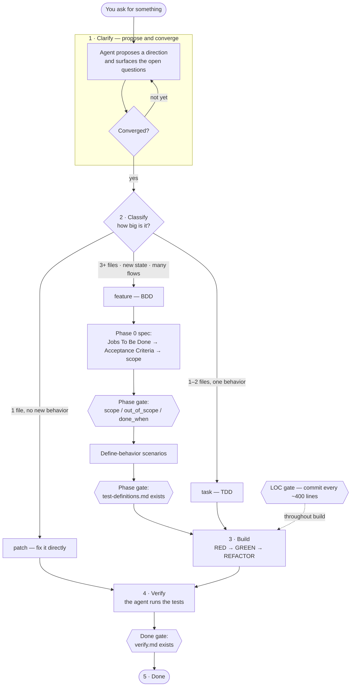

# SAFEWORD - AI Agent Configuration CLI

[](https://github.com/TheMostlyGreat/safeword/actions/workflows/ci.yml)

**Problem**: AI agents write code without tests, skip design validation, and lack consistency across projects.

**Solution**: Portable patterns and guides that enforce test-first development (BDD/TDD), quality standards, and best practices across all your projects.

**Repository**: <https://github.com/TheMostlyGreat/safeword>

---

## Quick Start (30 seconds)

**1. Install in your project:**

```bash
cd /path/to/your/project
bunx safeword@latest setup
```

**2. Verify installation:**

```bash
# Check for SAFEWORD files
test -f .safeword/SAFEWORD.md && echo ".safeword/SAFEWORD.md ✓"
test -f AGENTS.md && echo "AGENTS.md ✓"
```

**3. Enable Codex, if your team uses it:**

```bash
# Installs and verifies the profile-scoped plugin. Existing legacy hooks stay in place.
bunx safeword@latest migrate codex-plugin
```

Review the Safe Word plugin in Codex with `/hooks`. After it is trusted, explicitly remove only Safe Word-owned legacy hooks with `bunx safeword@latest migrate codex-plugin --remove-legacy-hooks`.

**Result**: Your project now has:

- `.safeword/SAFEWORD.md` - Global patterns and workflows
- `.safeword/guides/` - Testing methodology (BDD/TDD), code philosophy
- `.safeword/hooks/` - Auto-linting, quality review hooks
- `.claude/settings.json` - Hook configuration for Claude Code
- `.claude/skills/` - Skills and slash-command workflows for Claude Code
- Safe Word Codex plugin - Profile-scoped skills and hooks; install it with `safeword migrate codex-plugin`
- `.cursor/hooks.json` - Hook configuration for Cursor
- `.cursor/rules/` - Behavior rules for Cursor
- `.cursor/commands/` - Slash commands for Cursor
- `AGENTS.md` - Project context with framework reference

**Commit these to your repo** for team consistency.

---

## How It Fits Your Project

**Stack-agnostic** — Safeword is a process layer, not a framework opinion. It works alongside any stack — Next, Elysia, Astro, Django, Gin, whatever you use. Your application code and runtime dependencies are never touched.

**Your agent config stays yours** — Safeword uses `AGENTS.md` as the primary entry point. If you have an existing `CLAUDE.md`, it adds one import line at the top — your content is untouched.

**Dev-only tools** — Safeword installs ESLint, Prettier, supporting plugins, `jiti` for TypeScript config loading, plus the Gherkin acceptance lane (cucumber-js + tsx), as `devDependencies` — in every project. A pure Go/Python/Rust repo gets a minimal `private: true` package.json created to host them (the lane's step definitions are TypeScript and test your app from the outside). These are development tools — they never ship with your application or affect your runtime.

**AI guardrails, not human blockers** — Hooks and stricter linting rules only fire during AI agent sessions (Claude Code / Cursor / Codex events). They never run during normal human development. In repos that already use husky, setup appends one warn-only line to `pre-commit`/`pre-push` (the boundary evidence check — it reports, never blocks, and `safeword reset` removes it); safeword never installs a hook manager or blocks a commit.

**Use in CI if you want** — Safeword adds `lint`, `format`, and `test:bdd` scripts to your `package.json`. You can wire these into your CI pipeline or precommit hooks — but it's your choice, not forced.

---

## How It Works

Every session moves through five phases, in order — and three hard gates stop your agent skipping ahead:



- **Clarify** — the agent proposes a direction and converges with you before building. For features, this writes the product framing first: Jobs To Be Done → Acceptance Criteria → engineering scope.
- **Classify** — sizes the work as a **patch** (fix directly), **task** (TDD), or **feature** (BDD).
- **Build** — patches go straight to the fix; tasks and features run the RED → GREEN → REFACTOR loop, with features defining behavior scenarios first.
- **Verify** — the agent runs the relevant tests itself, never handing you something untested.
- **Done** — hard-blocked until `/verify` writes `verify.md` to the ticket.

The framework is **project-local** for Claude Code and Cursor: it writes to `.safeword/`, `.claude/`, and `.cursor/` in your repo. Codex uses the Safe Word plugin installed in each user's Codex profile; it receives no Codex-specific project-local configuration or workflow tree. Guides and learnings live in-repo and evolve as you work.

---

## Driving safeword without reading code

Safeword is built for people who ship software by directing an AI agent but don't read the code themselves. You stay in control by watching three things — no diff-reading required:

- **When the agent gets stopped.** Safeword blocks the agent when it tries to skip a step — shipping code with no tests, or closing work it hasn't verified. A block is safeword protecting you, not an error: the message says what's needed and the next action to clear it.
- **The end-of-turn verdict.** When the agent finishes a stretch of work it ends with a plain-English call — **CONFIDENT** (here's what I did and what's next) or **BLOCKED** (here's the one decision I need from you). That's your cue to continue, redirect, or step in.
- **`/explain`.** Any time a message doesn't make sense — a block, a verdict, or "where are we?" — type `/explain` for a plain-English version: what it means and what to do next. Works in Claude Code, Cursor, and Codex.

You direct in plain language; safeword keeps the agent honest. Auditing the code is the job it's doing for you.

---

## What's Inside

Key directories created in your project:

- `.safeword/guides/` - Core methodology and best practices
- `.safeword/templates/` - Fillable document structures
- `<namespace-root>/tickets/` - Tickets for complex/multi-step work (context anchors)
- `.safeword/hooks/` - Automation scripts for Claude Code and Cursor
- `.claude/skills/`, `.cursor/rules/` - Specialized agent capabilities
- Safe Word Codex plugin - Profile-scoped workflow skills and hooks
- `.cursor/commands/` - Slash commands for Cursor

---

## Core Guides

**Purpose**: Reusable methodology applicable to all projects

| Guide                           | Purpose                                                            | When to Read            |
| ------------------------------- | ------------------------------------------------------------------ | ----------------------- |
| **planning-guide.md**           | Feature planning workflow, spec creation, BDD/TDD integration      | Starting any feature    |
| **testing-guide.md**            | Test-first workflow (RED/GREEN/REFACTOR), test pyramid, test types | Writing tests           |
| **llm-evals-guide.md**          | AI output evaluation design, scorers, datasets, and cost controls  | Testing AI behavior     |
| **verification-lanes-guide.md** | Smoke, live-fire, release, migration, static, and slow/perf lanes  | Choosing test cadence   |
| **learning-extraction.md**      | Extract learnings from debugging, recognition triggers             | After complex debugging |

---

## Documentation Guides

**Purpose**: Writing effective feature documentation

| Guide                          | Purpose                                            | When to Read                   |
| ------------------------------ | -------------------------------------------------- | ------------------------------ |
| **design-doc-guide.md**        | Design doc structure and best practices            | Designing complex features     |
| **architecture-guide.md**      | Architecture decisions (tech choices, data models) | Making architectural decisions |
| **data-architecture-guide.md** | Data model design (schemas, validation, flows)     | Database/schema design         |
| **context-files-guide.md**     | CLAUDE.md/AGENTS.md structure and best practices   | Setting up project context     |

---

## Meta Guides

**Purpose**: Working with LLMs and documentation structure

| Guide                         | Purpose                                                           | When to Read                    |
| ----------------------------- | ----------------------------------------------------------------- | ------------------------------- |
| **llm-writing-guide.md**      | Writing docs that LLMs follow (MECE, examples, context placement) | Writing skills, commands, hooks |
| **zombie-process-cleanup.md** | Port-based cleanup, multi-project isolation                       | Managing dev servers            |

---

## Templates

**Purpose**: Fillable structures for feature documentation

| Template                        | Purpose                                         | Used By             |
| ------------------------------- | ----------------------------------------------- | ------------------- |
| **feature-spec-template.md**    | Feature spec (user stories + constraints)       | planning-guide.md   |
| **task-spec-template.md**       | Bug, improvement, refactor, or internal task    | planning-guide.md   |
| **test-definitions-feature.md** | BDD scenarios (Rule + Scenario + G/W/T + R/G/R) | planning-guide.md   |
| **design-doc-template.md**      | Design doc structure (architecture, components) | design-doc-guide.md |
| **architecture-template.md**    | ADR for decisions with long-term impact         | planning-guide.md   |
| **ticket-template.md**          | Context anchor for complex/multi-step work      | SAFEWORD.md         |
| **work-log-template.md**        | Scratch pad and working memory during execution | SAFEWORD.md         |

---

## Learnings

**Purpose**: Extracted knowledge that compounds across sessions

**Location**: `<namespace-root>/learnings/[concept].md`

**What goes here**:

- Debugging discoveries (non-obvious gotchas, integration struggles)
- Trial-and-error findings (tried 3+ approaches before right one)
- Architecture insights (discovered during implementation)
- Testing traps (tests pass but UX broken, or vice versa)

**How to extract**: Follow `learning-extraction.md` recognition triggers and templates

---

## Tickets

**Purpose**: Context anchors for complex/multi-step work to prevent LLM loops

**Location**: `<namespace-root>/tickets/{ID}-{slug}/` for tickets created by `safeword ticket new`. Older `{ID}/` and numeric `{id}-{slug}/` folders remain readable by ID.

**Structure**:

```plaintext
<namespace-root>/
├── tickets/
│   ├── 7K9M3P-login-bug/
│   │   ├── ticket.md           # Ticket definition (frontmatter + work log)
│   │   ├── test-definitions.md # BDD scenarios (Given/When/Then)
│   │   ├── spec.md             # Feature spec for epics (optional)
│   │   └── design.md           # Design doc for complex features (optional)
│   └── completed/              # Archive for done tickets
├── learnings/                  # Extracted knowledge (gotchas, discoveries)
└── tmp/                        # Scratch space (research, logs, etc.)
```

**When to create**: Multiple attempts likely, multi-step with dependencies, investigation needed, or risk of losing context

---

## Hooks, Commands & Skills

**Hooks** (in `.safeword/hooks/`): TypeScript automation scripts (Bun runtime)

- `session-verify-agents.ts` - Verifies AGENTS.md link on session start
- `session-version.ts` - Shows safeword version on session start
- `session-lint-check.ts` - Checks for lint errors on session start
- `session-cleanup-quality.ts` - Garbage-collects old quality state files on session end
- `session-compact-context.ts` - Re-injects active ticket context after context compaction
- `prompt-timestamp.ts` - Injects timestamp into prompts
- `prompt-questions.ts` - Reminds agent to ask clarifying questions
- `prompt-retro-nudge.ts` - Surfaces unfiled retro drafts on the next prompt
- `post-tool-lint.ts` - Auto-lints after file edits
- `post-tool-quality.ts` - Tracks LOC, detects phase changes and TDD steps
- `post-tool-bypass-warn.ts` - Warns when agent bypasses quality gates
- `post-tool-skill-nudge.ts` - On the first edit of a language with an installed coding-skill, points the agent at that skill (see Language coding-skills below)
- `post-tool-work-log.ts` - Stamps a real-timestamp work-log line in ticket.md when a phase transition lands
- `pre-tool-quality.ts` - Blocks edits when quality gate is active (LOC, phase, or TDD); on Bash, denies R/G/R ledger writes and machine-wide process kills (`killall node`)
- `pre-tool-config-guard.ts` - Guards against settings.json modifications
- `stop-quality.ts` - Quality review prompt on stop
- `cursor/after-file-edit.ts` - Auto-lints after Cursor file edits
- `cursor/stop.ts` - Quality review prompt on Cursor stop
- `cursor/post-tool-skill-nudge.ts` - Cursor adapter for the language coding-skill nudge (dormant pending Cursor bug #534)

Codex hooks live in the Safe Word plugin and run from the package with
`bunx --bun safeword@<plugin-version> hook codex <event>`. Install and verify
the profile-scoped plugin with `safeword migrate codex-plugin`; setup and upgrade
do not create project-local Codex hooks or workflow assets. Codex visibly skips
unreviewed or changed plugin hooks and directs the builder to `/hooks`; after
trusting the plugin, run `safeword migrate codex-plugin --remove-legacy-hooks`
to retire only Safe Word-owned legacy hooks. Codex edit-gate coverage is
limited to the documented PreToolUse tool calls Safeword configures (`Bash`,
`apply_patch` edit payloads, and file-editing tools). Live Codex runs can also
report `file_change` execution items; those are recorded as a runtime boundary,
not as edits Safeword claims to guard through PreToolUse. Codex Stop hooks use
continuation semantics (`decision: "block"`, `reason`) for done-phase reminders.

**Skills** (in `.claude/skills/`): Specialized agent capabilities

- `bdd/` - BDD orchestrator for feature-level work (Discovery, Scenarios, TDD, Verify, Splitting, Done)
- `debug/` - Four-phase debugging (investigate before fixing)
- `quality-review/` - Deep code review with web research
- `refactor/` - Small-step refactoring with test verification
- `testing/` - Test writing methodology (iron laws, anti-patterns)
- `ticket-system/` - Ticket system and work logs for context anchoring

**Codex plugin skills**: Codex gets Safe Word workflow skills from the Safe Word Codex plugin, with scoped names such as `safeword:bdd`, `safeword:verify`, and `safeword:explain`. Safeword no longer installs Safe Word-owned workflow aliases into `.agents/skills/`.

**Language coding-skills** (auto-installed per language): when safeword detects a Go, Python, TypeScript, or Rust project, `setup`/`upgrade` install a small third-party coding-skill for that language (via `npx skills`, into `.claude/skills/` and, where supported by the agent, `.agents/skills/`). These are third-party language helpers, not Safe Word Codex workflow files. The Claude Code on-edit nudge points the agent at the matching skill the first time you edit that language in a scenario; Cursor's adapter is dormant pending platform bug #534. Best-effort — a missing network or installer error degrades to a warning, never blocks setup. Note: frontier models already write most core idioms unaided, so this is a light nudge, not a transformation.

**Commands**: Cursor gets explicit command files in `.cursor/commands/`; Claude Code exposes slash-command behavior through skills. Codex uses plugin-scoped skills such as `safeword:bdd` rather than repo-scoped command files.

- `/audit` - Run architecture and dead code analysis
- `/bdd` - Force BDD flow for current task
- `/cleanup-zombies` - Kill zombie processes on ports
- `/debug` - Four-phase debugging framework
- `/explain` - Plain-English version of any safeword block, verdict, or your current state
- `/lint` - Run linters and formatters
- `/quality-review` - Deep code review with web research
- `/refactor` - Systematic refactoring with small-step discipline
- `/testing` - Test writing guidance and best practices
- `/verify` - Verify ticket criteria (tests, build, lint, scenarios, dep drift)

**MCP Servers** (in `.mcp.json` / `.cursor/mcp.json`): Auto-configured integrations

- **context7** - Up-to-date library documentation lookup
- **playwright** - Browser automation for testing

---

## CLI Commands

```bash
# Set up safeword in current project
bunx safeword@latest setup
bunx safeword@latest setup -y # Non-interactive mode

# Check project health and versions
bunx safeword@latest check
bunx safeword@latest check --offline # Skip remote version check

# Upgrade to latest version
bunx safeword@latest upgrade

# Preview changes before upgrading
bunx safeword@latest diff
bunx safeword@latest diff -v # Show full diff output

# Regenerate architecture config for /audit
bunx safeword@latest sync-config

# Remove safeword from project
bunx safeword reset
bunx safeword reset -y     # Skip confirmation
bunx safeword reset --full # Also remove linting config + packages
```

### Publishing (maintainers)

```bash
# From packages/cli/
bun publish
```

**Auto-detection**: Detects project type from `package.json` and enables relevant ESLint plugins only when the framework is installed:

- TypeScript, React, Next.js, Astro
- Vitest, Playwright, Storybook, Tailwind, Turbo, TanStack Query
- Publishable libraries (adds publint)

### How Guide Imports Work

`AGENTS.md` contains a link to `.safeword/SAFEWORD.md` (also added to `CLAUDE.md` if present).

SAFEWORD.md then imports guides via the Guides table. Claude Code, Cursor, and Codex load these project-local instructions through their own context surfaces.

### Check for Existing Learnings

```bash
ls < namespace-root > /learnings/
```

### Extract New Learning

1. Follow recognition triggers in `learning-extraction.md`
2. Create `<namespace-root>/learnings/[concept].md`
3. Use template: Problem → Gotcha → Examples → Testing Trap

---

## Syncing Across Machines

Commit the Safe Word project configuration your team uses, such as `.safeword/`, `.claude/`, and `.cursor/`, for team consistency. Each Codex user runs `safeword migrate codex-plugin` in their own profile; Safe Word does not create a repository `.codex` configuration or workflow tree.

---

## Customizing File Locations

Safeword reads project-level information from the project namespace root: `paths.projectRoot` when configured, `.project/` by default, or legacy `.safeword-project/` when that directory already exists. If you already maintain these docs elsewhere, point safeword at your existing files via the optional `paths` block in `.safeword/config.json`:

```json
{
  "installedPacks": ["typescript"],
  "paths": {
    "projectRoot": ".project",
    "personas": "docs/personas.md",
    "glossary": "docs/glossary.md",
    "surfaces": "docs/surfaces.md",
    "architecture": "ARCHITECTURE.md"
  },
  "docs": {
    "sources": [
      { "type": "local", "path": "README.md" },
      { "type": "local", "path": "docs" },
      { "type": "url", "url": "https://docs.example.com" },
      { "type": "git", "repo": "git@example.com:org/docs.git", "path": "product" }
    ]
  }
}
```

**Rules:**

- All `paths.*` keys are optional. Unset per-file keys fall back to `<namespace-root>/<key>.md`.
- Relative paths resolve against project root (the directory containing `.safeword/config.json`).
- Absolute paths are used verbatim — useful for shared monorepo setups where the file lives outside this project's tree.
- When an override is set, `safeword setup` does NOT scaffold the default-location stub — one personas.md per project, where you named it.
- `safeword check` validates the configured file. If the file is missing, you get a `personas-path:` error with non-zero exit (loud failure on configured-but-missing). If `.safeword-project/personas.md` still exists from a prior install, you get a zero-exit advisory naming the orphaned file (cleanup is up to you — safeword never deletes user content).

Tickets and learnings derive from `paths.projectRoot`. Personas, glossary, and architecture can also be redirected individually with their own `paths.*` keys.

`docs.sources` tells audit where customer documentation lives. Local sources are validated by `safeword check`; URL and git sources are declared inventory for audit runs, which should fetch them when available or report them as skipped coverage. If you want audit to keep using fallback discovery and stop asking for configured sources, set `"docs": { "sources": [] }`.

---

## Integration with Project Context

**How it works**:

1. `AGENTS.md` links to `.safeword/SAFEWORD.md` (also adds one import line to `CLAUDE.md` if present)
2. `SAFEWORD.md` imports guides via Guides table
3. Guides cross-reference each other and templates
4. Learnings stored in `<namespace-root>/learnings/`

**Result**: Modular, maintainable documentation with clear separation of concerns

---

## Principles

1. **Guides** - Reusable methodology (test pyramid, BDD/TDD workflow)
2. **Templates** - Fillable structures (user stories, test definitions)
3. **Learnings** - Extracted knowledge (gotchas, discoveries)
4. **Planning** - Feature planning and design (user stories, test definitions, design docs)
5. **Hooks/Skills** - Automation and specialized capabilities

**Living Documentation**: Update as you learn, archive completed work, consolidate when needed

---

## FAQ

**Will safeword change my stack or framework?**
No. Safeword is a process overlay — it adds quality enforcement (BDD/TDD, linting, code review) on top of whatever you already use. It doesn't install application dependencies or modify your source code.

**Will it overwrite my CLAUDE.md?**
No. Safeword uses `AGENTS.md` as the primary entry point. If you have an existing `CLAUDE.md`, it prepends a single 4-line block that links to `.safeword/SAFEWORD.md`. Your existing content stays exactly where it is.

**What packages does it install?**
For JS/TS projects: ESLint, Prettier, supporting plugins, and `jiti` for TypeScript ESLint config loading — all as `devDependencies` (the `-D` flag). These are code quality tools, not application dependencies. Python, Go, and Rust (beta) use their language-native linters (ruff, golangci-lint, clippy).

**I use Biome, dprint, oxfmt, or deno fmt — is that a problem?**
No. Safeword detects a non-Prettier formatter (`biome.json`, `dprint.json`, `.oxfmtrc.*`, `deno.json`) and steps aside: it skips Prettier at install **and** its auto-format hook leaves all formatting to your tool — agent edits are never run through Prettier, for any file type (JS/TS, JSON, CSS, YAML). Files your formatter doesn't cover are left untouched rather than Prettier-formatted. ESLint still runs, because those formatters don't cover security scanning (`eslint-plugin-security`), cyclomatic complexity (`sonarjs`), or framework rules (React hooks, Next.js, Astro); safeword's ESLint config disables formatting rules, so it lints without fighting your formatter.

**Do teammates need to install safeword separately?**
No. Commit the Safe Word project configuration your team uses, such as `.safeword/`, `.claude/`, and `.cursor/`. Each Codex user installs the Safe Word plugin into their own profile with `safeword migrate codex-plugin`, reviews it in `/hooks`, then explicitly chooses whether to run `--remove-legacy-hooks`. The linting devDependencies install automatically with `npm install` / `bun install`.

**Will it interfere with my development workflow?**
No. Safeword's hooks and stricter linting rules only fire during AI agent sessions. They don't run when you code normally. In husky repos, setup appends one warn-only boundary-check line to `pre-commit`/`pre-push` — it reports workflow-evidence gaps, never blocks a commit, and `safeword reset` removes it. Safeword never installs a hook manager. It also adds `lint`, `format`, and `test:bdd` scripts to `package.json` that you can optionally use in CI or precommit hooks.

**What Claude Code permissions does safeword need?**
Safeword's feature-ticket done-gate verifies that `/verify` and `/audit` were actually invoked by reading a session-scoped log written via bash injection at the top of each skill. If Claude Code denies that bash injection, feature tickets hard-block at done-phase.

To pre-approve the injection without prompts (recommended for headless / non-interactive sessions), add these patterns to `.claude/settings.json`:

```json
{
  "permissions": {
    "allow": ["Bash(bun */.safeword/hooks/record-skill-invocation.ts*)"]
  }
}
```

This pre-approves the current safeword helper invocation:

- Claude Code evaluates compound bash commands per subcommand, so the allow rule only needs to cover the Bun helper that writes the log.
- `Bash(bun */.safeword/hooks/record-skill-invocation.ts*)` matches Bun running safeword's installed invocation logger from the project `.safeword/hooks/` directory.
- No `node -e`, `mkdir -p`, or `echo` allow rule is needed for the current injection. The helper performs the write itself, and Claude Code treats `echo` plus read-only `git` forms as read-only commands.

The injection itself resolves the project namespace root and writes timestamped lines to `<namespace-root>/skill-invocations.log` — no network calls, no file mutation outside that path. Feature-ticket done gates require this session-scoped proof. Task and patch tickets can still use `verify.md` when session-scoped invocation proof is unavailable and not required by the gate.

---

## Development

This section is for contributors to safeword itself.

### Tech Stack

| Component | Technology                  |
| --------- | --------------------------- |
| Runtime   | Bun (dev), Node 22+ (users) |
| CLI       | TypeScript, Commander.js    |
| Build     | tsup (ESM-only output)      |
| Tests     | Vitest                      |
| Linting   | ESLint 10 + Prettier        |

### Optional System Binaries

These tools enhance development scripts but are not required:

| Binary  | Purpose                       | Script           | Install                 |
| ------- | ----------------------------- | ---------------- | ----------------------- |
| `shfmt` | Format shell scripts in repo  | `bun format:sh`  | `brew install shfmt`    |
| `dot`   | Generate dependency graph SVG | `bun deps:graph` | `brew install graphviz` |

Without these binaries, the scripts print a message and skip.

### Development Workflow

**Editing Source Templates:**

1. Edit in `packages/cli/templates/` (source of truth)
2. Run `bunx safeword upgrade` to sync to `.safeword/`
3. Test changes

**Running Tests:**

```bash
# Important: Use `bun run test` (Vitest), NOT `bun test` (Bun's runner)
bun run test                      # All tests
bunx vitest run tests/foo.test.ts # Single file
bun run test:integration          # Integration tests
bun run test:watch                # Watch mode
```

**Publishing:**

Always run `bun publish` from `packages/cli/` directory, not the monorepo root.

### CLI Parity (Claude Code / Cursor / Codex)

The CLI installs matching workflow capabilities for Claude Code, Cursor, and Codex using each agent's native surface.

**Source of truth:** `packages/cli/src/schema.ts`

**Parity tests:** `packages/cli/tests/schema.test.ts`

| Agent       | Workflow Surface                         | Commands / Hooks                                                                    |
| ----------- | ---------------------------------------- | ----------------------------------------------------------------------------------- |
| Claude Code | `.claude/skills/*`                       | Skills expose slash-command behavior                                                |
| Cursor      | `.cursor/rules/{safeword-*,bdd-*}.mdc`   | `.cursor/commands/*.md`, `.cursor/hooks.json`                                       |
| Codex       | Codex plugin skills (`safeword:<skill>`) | Plugin hooks call version-pinned `bunx --bun safeword@<version> hook codex <event>` |

**Editing skills:**

1. Edit canonical workflow templates in `packages/cli/templates/skills/` and Cursor rules in `packages/cli/templates/cursor/rules/`
2. Run `bun run --cwd packages/cli generate:codex-plugin` to regenerate the checked-in Codex plugin catalogue
3. Run the catalogue, package, cache, and parity tests
4. Run `bunx safeword upgrade` to sync Claude Code and Cursor project assets; Codex users update through their profile plugin migration

---

## Getting Help

- **Claude Code docs**: <https://docs.claude.com/en/docs/claude-code>
- **OpenAI Codex docs**: <https://developers.openai.com/codex>
- **This repo**: <https://github.com/TheMostlyGreat/safeword>
