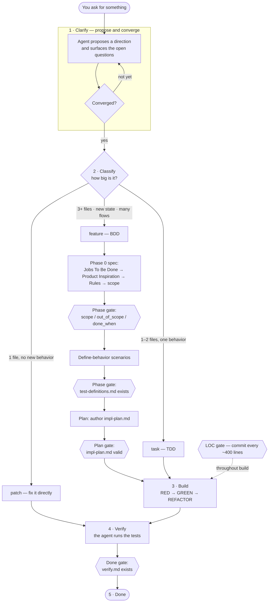

# SAFEWORD - AI Agent Configuration CLI

[](https://github.com/ArcadeAI/safeword/actions/workflows/ci.yml)

**Problem**: AI agents write code without tests, skip design validation, and lack consistency across projects.

**Solution**: Portable patterns and guides that enforce test-first development (BDD/TDD), quality standards, and best practices across all your projects.

**Repository**: <https://github.com/ArcadeAI/safeword>

---

## Quick Start (30 seconds)

**1. Install in your project and native agent profiles:**

```bash
cd /path/to/your/project
bunx safeword@latest install
```

By default, this configures the project and installs both the Claude Code and
Codex plugins. OpenCode and Cursor stay untouched unless you explicitly select
them:

```bash
bunx safeword@latest install --agents=cursor
# Or install every integration:
bunx safeword@latest install --agents=claude,codex,opencode,cursor
```

OpenCode is intentionally opt-in because its guard is installed in the current
user's OpenCode profile. The project receives declarative commands and agents,
reuses the canonical `.claude/skills` catalogue OpenCode already discovers,
and leaves `opencode.json` untouched:

```bash
bunx safeword@latest install --agents=opencode
bunx safeword@latest conformance --agents=opencode
bunx safeword@latest status --agents=opencode
```

Conformance runs a credential-free real OpenCode process. Safeword reports the
pinned CLI/TUI boundary as protected only after that process discovers the
native catalogue and proves a forbidden tool call produces no side effect.
OpenCode Desktop remains advisory until it reliably dispatches the same hooks.

**2. Activate the installed profile plugins:**

```bash
# In Claude Code, run: /reload-plugins
# Review hooks in Desktop Settings > Hooks (or /hooks in the TUI), then fully restart Codex and resume this task
```

**3. Verify installation:**

```bash
bunx safeword@latest doctor
```

**Claude activation scope.** `install` records Claude activation for this
project in `.claude/settings.json`, so the repository declares its dependency
and collaborators are prompted to install it after trusting the folder. Add
`--scope user` to activate Safeword across every project in your Claude
profile instead:

```bash
bunx safeword@latest install --agents=claude --scope user
bunx safeword@latest claude status
```

Existing projects keep their working legacy Claude hooks until the exact current
plugin successfully handles a prompt. That prompt then retires every byte and
hook entry Safeword can prove came from a supported release. Clean migration is
silent; edited, third-party, symlinked, or otherwise unrecognized content stays
untouched and produces one plain-language advisory per Claude session. The
project-scoped marketplace and enablement declarations remain committed so the
next trusted teammate is offered the plugin normally.

The explicit commands remain available for diagnosis and recovery:

```bash
bunx safeword@latest claude cleanup
# Run the exact --yes --plan command returned by the preview.
# If interrupted, status reports recovery-required:
bunx safeword@latest claude recover
```

Cleanup never installs, enables, reloads, or changes plugin trust. Automatic
migration is bounded, never blocks a successful prompt, and resumes from a
durable transaction after interruption or a competing developer process.

**Codex startup.** Installing commits project-level `SessionStart` hooks. One
enrolls each developer's Codex profile in the released `stable` channel; the
other prepares missing project dependencies in trusted fresh worktrees so the
repository's checks are available before work begins.

The running Codex app cannot load a newly installed plugin into a task that has
already started — and starting a new task alone isn't enough either, since the
app itself keeps the old plugin catalogue loaded. The bootstrap therefore
prints a loud startup warning until you fully restart Codex and resume the
task, which records native proof for that same task. It never intercepts or blocks
edits or commands. If the already-open task previously observed an older
Safeword runtime, bootstrap reports that narrower fact instead of calling the
task wholly unverified; the retained history never proves the installed update
and never authorizes cleanup. On the first ordinary upgrade of an unmodified
legacy installation, Safeword installs the native plugin first, then backs up
and removes the recognized legacy assets automatically. Ambiguous or edited
legacy content is preserved and reported instead.

**Result**: Your project now has:

- `.safeword/SAFEWORD.md` - Global patterns and workflows
- `.safeword/guides/` - Testing methodology (BDD/TDD), code philosophy
- `.safeword/skills/` - Canonical project-local skill references when Cursor is selected
- `.safeword/hooks/` - Auto-linting, quality review hooks
- `.claude/settings.json` - Project-scoped Safeword Claude activation by default
- Safeword Claude plugin - Native workflows and hooks cached by Claude; use `safeword install --agents=claude --scope user` for profile-wide activation
- `.codex/config.toml` - Project bootstrap that enrolls each Codex profile at task start
- Safeword Codex plugin - Profile-scoped skills and hooks following the verified `stable` channel
- `.opencode/commands/` and `.opencode/agents/` - Native OpenCode catalogue bridges, installed only when selected
- Safeword OpenCode profile plugin - Stable pre-tool enforcement with activation and conformance evidence
- `.cursor/hooks.json` - Hook configuration for Cursor
- `.cursor/rules/` - Behavior rules for Cursor
- `.cursor/commands/` - Slash commands for Cursor

**Commit these to your repo** for team consistency.

---

## How It Fits Your Project

**Stack-agnostic** — Safeword is a process layer, not a framework opinion. It works alongside any stack — Next, Elysia, Astro, Django, Gin, whatever you use. Your application code and runtime dependencies are never touched.

**Your agent config stays yours** — Safeword-owned hooks load `.safeword/SAFEWORD.md` for Claude Code, Cursor, and Codex. Claude plugin installation defaults to project-scoped activation in `.claude/settings.json`, while `--scope user` remains available for profile-wide activation; explicit native-update opt-outs are preserved. Codex install merges only its marked SessionStart bootstrap into `.codex/config.toml` and preserves unrelated configuration. Install does not create or add imports to customer-owned `AGENTS.md` or `CLAUDE.md`; existing project instructions remain yours.

**Dev-only tools** — Safeword installs ESLint, Prettier, supporting plugins, `jiti` for TypeScript config loading, plus the Gherkin acceptance lane (cucumber-js + tsx), as `devDependencies` — in every project. A pure Go/Python/Rust repo gets a minimal `private: true` package.json created to host them (the lane's step definitions are TypeScript and test your app from the outside). These are development tools — they never ship with your application or affect your runtime.

**AI guardrails, not human blockers** — Hooks and stricter linting rules only fire during AI agent sessions (Claude Code / Cursor / Codex / OpenCode events). They never run during normal human development. In repos that already use husky, install appends one warn-only line to `pre-commit`/`pre-push` (the boundary evidence check — it reports, never blocks, and `safeword uninstall --agents=none` removes it); safeword never installs a hook manager or blocks a commit.

**Use in CI if you want** — Safeword adds `lint`, `format`, and `test:bdd` scripts to your `package.json`. You can wire these into your CI pipeline or precommit hooks — but it's your choice, not forced.

---

## How It Works

Every session moves through five phases, in order — and four hard gates stop your agent skipping ahead:


```mermaid
flowchart TD
    start([You ask for something])
    start --> propose

    subgraph clarify ["1 · Clarify — propose and converge"]
      direction TB
      propose["Agent proposes a direction<br/>and surfaces the open questions"]
      converged{"Converged?"}
      propose --> converged
      converged -->|"not yet"| propose
    end

    converged -->|"yes"| classify{"2 · Classify<br/>how big is it?"}

    classify -->|"1 file, no new behavior"| patch["patch — fix it directly"]
    classify -->|"1–2 files, one behavior"| task["task — TDD"]
    classify -->|"3+ files · new state · many flows"| feature["feature — BDD"]

    feature --> phase0["Phase 0 spec:<br/>Jobs To Be Done → Product Inspiration → Rules → scope"]
    phase0 --> g1{{"Phase gate:<br/>scope / out_of_scope / done_when"}}
    g1 --> scenarios["Define-behavior scenarios"]
    scenarios --> g2{{"Phase gate:<br/>test-definitions.md exists"}}
    g2 --> plan["Plan: author impl-plan.md"]
    plan --> g4{{"Plan gate:<br/>impl-plan.md valid"}}
    g4 --> build

    task --> build["3 · Build<br/>RED → GREEN → REFACTOR"]
    patch --> verify

    build --> verify["4 · Verify<br/>the agent runs the tests"]
    verify --> g3{{"Done gate:<br/>verify.md exists"}}
    g3 --> done([5 · Done])

    loc{{"LOC gate — commit every ~400 lines"}} -.->|throughout build| build
```

- **Clarify** — the agent proposes a direction and converges with you before building. For features, this writes the product framing first: Jobs To Be Done → Product Inspiration (who does this exceptionally well, what customers value, and what principle transfers) → Rules → engineering scope.
- **Classify** — sizes the work as a **patch** (fix directly), **task** (TDD), or **feature** (BDD).
- **Build** — patches go straight to the fix; tasks and features run the RED → GREEN → REFACTOR loop, with features defining behavior scenarios and an implementation plan first.
- **Verify** — the agent runs the relevant tests itself, never handing you something untested.
- **Done** — hard-blocked until `/verify` writes `verify.md` to the ticket.

Project state remains local in `.safeword/` and the configured namespace root. Claude Code and Codex load framework workflows from versioned user-profile plugins; Cursor keeps its project-local rules and hooks. Guides and learnings live in-repo and evolve as you work.

---

## Driving safeword without reading code

Safeword is built for people who ship software by directing an AI agent but don't read the code themselves. You stay in control by watching three things — no diff-reading required:

- **When the agent gets stopped.** Safeword blocks the agent when it tries to skip a step — shipping code with no tests, or closing work it hasn't verified. A block is safeword protecting you, not an error: the message says what's needed and the next action to clear it.
- **The end-of-turn verdict.** When the agent finishes a stretch of work it ends with a plain-English call — **CONFIDENT** (here's what I did and what's next) or **BLOCKED** (here's the one decision I need from you). That's your cue to continue, redirect, or step in.
- **`/explain`.** Any time a message doesn't make sense — a block, a verdict, or "where are we?" — type `/explain` for a plain-English version: what it means and what to do next. Works in Claude Code, Cursor, and Codex.

You direct in plain language; safeword keeps the agent honest. Auditing the code is the job it's doing for you.

---

## What's Inside

Key directories created in your project:

- `.safeword/guides/` - Core methodology and best practices
- `.safeword/templates/` - Fillable document structures
- `<namespace-root>/tickets/` - Tickets for complex/multi-step work (context anchors)
- `.safeword/hooks/` - Automation scripts for Claude Code and Cursor
- Safeword Claude plugin, `.cursor/rules/` - Specialized agent capabilities
- Safeword Codex plugin - Profile-scoped workflow skills and hooks
- `.cursor/commands/` - Slash commands for Cursor

---

## Core Guides

**Purpose**: Reusable methodology applicable to all projects

| Guide                           | Purpose                                                            | When to Read            |
| ------------------------------- | ------------------------------------------------------------------ | ----------------------- |
| **planning-guide.md**           | Feature planning workflow, spec creation, BDD/TDD integration      | Starting any feature    |
| **testing-guide.md**            | Test-first workflow (RED/GREEN/REFACTOR), test pyramid, test types | Writing tests           |
| **llm-evals-guide.md**          | AI output evaluation design, scorers, datasets, and cost controls  | Testing AI behavior     |
| **verification-lanes-guide.md** | Smoke, live-fire, release, migration, static, and slow/perf lanes  | Choosing test cadence   |
| **learning-extraction.md**      | Extract learnings from debugging, recognition triggers             | After complex debugging |

---

## Documentation Guides

**Purpose**: Writing effective feature documentation

| Guide                          | Purpose                                            | When to Read                   |
| ------------------------------ | -------------------------------------------------- | ------------------------------ |
| **design-doc-guide.md**        | Design doc structure and best practices            | Designing complex features     |
| **architecture-guide.md**      | Architecture decisions (tech choices, data models) | Making architectural decisions |
| **data-architecture-guide.md** | Data model design (schemas, validation, flows)     | Database/schema design         |
| **context-files-guide.md**     | CLAUDE.md/AGENTS.md structure and best practices   | Setting up project context     |

---

## Meta Guides

**Purpose**: Working with LLMs and documentation structure

| Guide                         | Purpose                                                           | When to Read                    |
| ----------------------------- | ----------------------------------------------------------------- | ------------------------------- |
| **llm-writing-guide.md**      | Writing docs that LLMs follow (MECE, examples, context placement) | Writing skills, commands, hooks |
| **zombie-process-cleanup.md** | Port-based cleanup, multi-project isolation                       | Managing dev servers            |

---

## Templates

**Purpose**: Fillable structures for feature documentation

| Template                        | Purpose                                                                   | Used By             |
| ------------------------------- | ------------------------------------------------------------------------- | ------------------- |
| **spec-template.md**            | Feature spec (JTBD + Numbered Rules) — scaffolded automatically at intake | SAFEWORD.md         |
| **feature-spec-template.md**    | Legacy manual feature spec (user stories); superseded by spec-template.md | planning-guide.md   |
| **task-spec-template.md**       | Bug, improvement, refactor, or internal task                              | planning-guide.md   |
| **test-definitions-feature.md** | BDD scenarios (Rule + Scenario + G/W/T + R/G/R)                           | planning-guide.md   |
| **design-doc-template.md**      | Design doc structure (architecture, components)                           | design-doc-guide.md |
| **architecture-template.md**    | Living architecture decision structure                                    | planning-guide.md   |
| **adr-template.md**             | Standalone record for a structural or hard-to-reverse decision            | planning-guide.md   |
| **impl-plan-template.md**       | Feature implementation plan, authored before TDD starts                   | planning-guide.md   |
| **ticket-template.md**          | Context anchor for complex/multi-step work                                | SAFEWORD.md         |
| **work-log-template.md**        | Scratch pad and working memory during execution                           | SAFEWORD.md         |
| **tripwire-template.md**        | Upstream-workaround tripwire (header + pinned-version test)               | testing-guide.md    |

---

## Learnings

**Purpose**: Extracted knowledge that compounds across sessions

**Location**: `<namespace-root>/learnings/[concept].md`

**What goes here**:

- Debugging discoveries (non-obvious gotchas, integration struggles)
- Trial-and-error findings (tried 3+ approaches before right one)
- Architecture insights (discovered during implementation)
- Testing traps (tests pass but UX broken, or vice versa)

**How to extract**: Follow `learning-extraction.md` recognition triggers and templates

---

## Tickets

**Purpose**: Context anchors for complex/multi-step work to prevent LLM loops

**Location**: `<namespace-root>/tickets/{ID}-{slug}/` for tickets created by `safeword ticket new`. Older `{ID}/` and numeric `{id}-{slug}/` folders remain readable by ID.

**Structure**:

```plaintext
<namespace-root>/
├── tickets/
│   ├── 7K9M3P-login-bug/
│   │   ├── ticket.md           # Ticket definition (frontmatter + work log)
│   │   ├── test-definitions.md # BDD scenarios (Given/When/Then)
│   │   ├── spec.md             # Feature spec, auto-created at intake (features only)
│   │   └── design.md           # Design doc for complex features (optional)
│   └── completed/              # Archive for done tickets
├── learnings/                  # Extracted knowledge (gotchas, discoveries)
└── tmp/                        # Scratch space (research, logs, etc.)
```

**When to create**: Multiple attempts likely, multi-step with dependencies, investigation needed, or risk of losing context

---

## Hooks, Commands & Skills

**Hooks** (in `.safeword/hooks/`): TypeScript and shell automation organized by lifecycle and host. Session hooks load standing context, heal generated architecture, check dependencies, and manage resumable state. Pre/post-tool hooks guard owned configuration, enforce ticket phases, lint edits, record evidence, and protect Git/process boundaries. Stop hooks run verification, review, retro, and re-entry flows. Claude Code and Cursor use project-local adapters; Codex dispatches equivalent events through the profile plugin. The installed hook manifests—not a hand-maintained README list—are the source of truth.

Codex hooks live in the Safeword plugin and run from the package with
`bunx --bun safeword@<plugin-version> hook codex <event>`. Install and verify
the profile-scoped plugin immediately with `safeword install --agents=codex`; install also
creates project-level SessionStart hooks for enrollment and dependency
preparation, never an edit or shell-command interception hook. Startup remains
advisory, while repository-owned composed commands require readiness. The plugin does not
implicitly enroll repositories: until `safeword install` creates
`.safeword/SAFEWORD.md`, project gates fail open and hooks do not create
`.project/` or other project state. Codex visibly skips
unreviewed or changed plugin hooks and directs the builder to Desktop
Settings > Hooks or `/hooks` in the terminal TUI. Review changed hooks before
restarting so the resumed task's SessionStart can run the first time. Use
`safeword codex status` to see which implementation currently protects the
repository and one safe next action. It also reports active profile-level
`AGENTS.md` guidance that matches or resembles retired Safeword instructions.
If Codex finds an old, unmodified Safeword install, `safeword codex
clean-guidance` shows exactly what it plans to remove before touching
anything — run the `--yes --plan <plan-id>` command it prints to back it up.
If you've edited that file yourself, Safeword leaves it alone and just warns
you. During ordinary upgrades, Safeword backs up and retires a fully
recognized legacy installation automatically, but only after the native
plugin installs successfully; anything edited or unrecognized stays untouched.
The explicit migration and recovery commands remain available for diagnosis. Codex
edit-gate coverage is
limited to the documented PreToolUse tool calls Safeword configures (`Bash`,
`apply_patch` edit payloads, and file-editing tools). Live Codex runs can also
report `file_change` execution items; those are recorded as a runtime boundary,
not as edits Safeword claims to guard through PreToolUse. Codex Stop hooks use
continuation semantics (`decision: "block"`, `reason`) for done-phase reminders
and evidence remediation. When a Codex session is bound to an in-progress
done-phase ticket and shared evidence passes, Stop also marks that ticket done;
it never stages, commits, or opens a PR.

**Skills** (in `.claude/skills/`): On-demand workflows for planning, BDD/TDD, debugging, elicitation, architecture exploration, review, refactoring, verification, retrospectives, linting, testing, ticket management, and safe session closeout. The directory is the source of truth; generated Codex equivalents use the `safeword:<skill>` namespace. Internal `finish-review` guidance is not a user command: class-1 review workflows (those requiring independent/cross-model review, as opposed to class-2's self-verifiable checks) invoke it only after the CLI coordinator returns typed route exhaustion.

Review prefers every independent Claude/Codex CLI route, then same-agent
headless review. If those routes cannot complete, a foreground agent makes one
best-effort fresh-context host review and then one bounded self-review. Those
last two routes are useful feedback, not independent evidence; `require` stays
blocked and no independent stamp is written. Both read the live worktree, so
their assurance says source integrity was not revalidated. Project-owned Claude
reviewer assets also support Claude Code Cloud when no external agent CLI is
available.

**Codex plugin skills**: Codex gets Safeword workflow skills from the Safeword Codex plugin, with scoped names such as `safeword:bdd`, `safeword:verify`, and `safeword:explain`. Safeword no longer installs Safeword-owned workflow aliases into `.agents/skills/`.

**Language coding-skills** (auto-installed per language): when safeword detects a Go, Python, TypeScript, or Rust project, `install` installs a small third-party coding-skill for that language (via `npx skills`, into `.claude/skills/` and, where supported by the agent, `.agents/skills/`). These are third-party language helpers, not Safeword Codex workflow files. The Claude Code on-edit nudge points the agent at the matching skill the first time you edit that language in a scenario; Cursor's adapter is dormant pending platform bug #534. Best-effort — a missing network or installer error degrades to a warning, never blocks install. Note: frontier models already write most core idioms unaided, so this is a light nudge, not a transformation.

**Commands**: Cursor gets explicit command files in `.cursor/commands/`; Claude Code exposes slash-command behavior through skills. Codex uses plugin-scoped skills such as `safeword:bdd` rather than repo-scoped command files.

- `/audit` - Run architecture and dead code analysis
- `/bdd` - Force BDD flow for current task
- `/cleanup-zombies` - Preview or kill current-project zombie processes
- `/debug` - Four-phase debugging framework
- `/explain` - Plain-English version of any safeword block, verdict, or your current state
- `/lint` - Run linters and formatters
- `/quality-review` - Deep code review with web research
- `/closeout` - Verify, explicitly authorized merge and cleanup, capture retro learning, and remove exact branch/worktree targets
- `/refactor` - Systematic refactoring with small-step discipline
- `/spike` - Resolve one build-only kill-risk with a bounded disposable experiment
- `/testing` - Test writing guidance and best practices
- `/verify` - Verify ticket criteria (tests, build, lint, scenarios, dep drift)

Closeout can resume after its topic worktree has already been removed. The
guard stores a private 24-hour receipt in Git's shared common directory only
after every applicable post-merge lane passes on the clean exact pull-request
head. Dependency auditing remains a pre-merge delivery gate; mutable advisory
data cannot strand cleanup of an immutable merged head. Claude Code and Cursor
use hook-captured session identity, while Codex Desktop may use its authenticated
`CODEX_THREAD_ID` when the one-shot hook bridge is unavailable. Missing, stale,
malformed, dirty-state, or wrong-head proof blocks the remaining branch cleanup.
If the bound transcript grows between preview and apply, closeout refreshes the
retrospective while preserving authorization for unchanged cleanup targets.
Every retrospective outcome is advisory for cleanup, including missing identity,
incomplete extraction, malformed output, filing failures, and pending drafts. The
result still reports when cleanup could discard captured but unfiled learning.

**MCP Servers** (in `.mcp.json` / `.cursor/mcp.json`): Auto-configured integrations

- **context7** - Up-to-date library documentation lookup
- **playwright** - Browser automation for testing

---

## CLI Commands

```bash
# Read-only health and reconciliation
bunx safeword@latest
bunx safeword@latest status
bunx safeword@latest doctor
bunx safeword@latest plan

# Converge Safeword in the current project and selected integrations
bunx safeword@latest install

# Project and tracker workflows
bunx safeword@latest project sync-config
bunx safeword@latest project architecture
bunx safeword@latest tracker sync

# Preview removal, then run the exact confirmation command Safeword prints
bunx safeword@latest uninstall

# Discover the stable agent interface
bunx safeword@latest capabilities --json --no-input
```

Global `--json`, `--no-input`, `--cwd`, `--quiet`, `--offline`, and
`--verbose` options work before or after public commands. The former `check`,
`upgrade`, `diff`, `reset`, `sync-config`, and related top-level names remain
hidden compatibility aliases indefinitely. New documentation and automation use
the canonical commands above.

### Publishing (maintainers)

Normal releases are CI-driven: merge the version bump, create the annotated
`vX.Y.Z` tag on the merge commit, and push it. The Release workflow builds and
tests without publish credentials, then publishes the packed artifact through
npm OIDC with provenance. See the `versioning` skill for the complete procedure;
local `bun publish` is defense-in-depth recovery tooling, not the release path.

When a release changes the native Claude plugin or a source asset it bundles,
run `bun run --cwd packages/cli generate:claude-release-assets` before merging
the version bump. It refreshes the historical catalogue first, then rebuilds
the plugin that embeds it; commit the resulting source and `plugin/` changes.

When a release changes the native Claude plugin or its profile installer, stable
publication also requires the previous-stable-to-candidate upgrade in the
[Claude plugin manual acceptance runbook](packages/cli/tests/smoke/claude-plugin-manual-acceptance.md).
This real-host gate verifies Claude's currently undocumented same-name
marketplace replacement behavior before users depend on it.

**Auto-detection**: Detects project type from `package.json` and enables relevant ESLint plugins only when the framework is installed:

- TypeScript, React, Next.js, Astro
- Vitest, Playwright, Storybook, Tailwind, Turbo, TanStack Query
- Publishable libraries (adds publint)

### How Guide Imports Work

Safeword-owned session hooks load `.safeword/SAFEWORD.md`. SAFEWORD.md then
routes agents to the relevant guides and templates. Customer `AGENTS.md` and
`CLAUDE.md` remain independent project context and are never required to import
Safeword.

### Check for Existing Learnings

```bash
ls < namespace-root > /learnings/
```

### Extract New Learning

1. Follow recognition triggers in `learning-extraction.md`
2. Create `<namespace-root>/learnings/[concept].md`
3. Use template: Problem → Gotcha → Examples → Testing Trap

---

## Syncing Across Machines

Commit the Safeword project configuration your team uses, including the marked `.codex/config.toml` SessionStart bootstrap. It enrolls each Codex profile independently without committing profile state or a repository workflow tree.

---

## Advisory Pull Request Review

Safeword can install a default-off GitHub Actions reviewer that treats pull
request changes as data, never checks out or executes them, and publishes one
ordinary conversation comment. The comment is explicitly advisory: it cannot
approve a pull request, satisfy a required check, or prove the change is safe to
merge.

Enable it in `.safeword/config.json` with an OpenAI model, a total evidence
budget, and the exact prerequisite check contexts to wait for:

```json
{
  "prReview": {
    "enabled": true,
    "provider": "openai",
    "model": "gpt-5.2",
    "maxTotalBytes": 100000,
    "requiredChecks": [{ "context": "ci" }]
  }
}
```

Run `safeword install` after enabling it. Configure `OPENAI_API_KEY` as an
environment secret on the `safeword-pr-review-model` GitHub environment. An
explicit empty `requiredChecks` array means review immediately; omitting the
field fails closed with a configuration next action. Pending checks are sampled
again by a five-minute sweep. Missing or over-budget text evidence, model
failure, findings, and unresolved unknowns all route to a human. Binary files
with recognized binary extensions are recorded as skipped; a binary-only change
cannot look ready.

Safeword runs this as one `pull_request_target` workflow — so it always runs
with base-branch privileges, even for fork PRs — split into privilege-scoped
jobs: an inspection job reads the PR's data (never its code) and calls the
model without any GitHub write permission, and a separate publisher job posts
the result without ever touching the model secret. GitHub currently requires
`pull-requests: write` for an ordinary pull-request conversation comment, so the
publisher is additionally constrained by Safeword's fixed issue-comment-only
boundary and the compatibility smoke verifies that it creates no review, check,
status, or merge change.

Deterministic release tests always validate the advisory workflow contract.
Live GitHub compatibility is monitored separately so sandbox availability or
credentials cannot block unrelated releases. A daily canary and default-branch
manual dispatch watch for environment-secret, fork-event, and concurrency drift.
Keep the customer workflow disabled until a live smoke passes where it will run.

### Maintainer compatibility proof

The release environment named `pr-review-smoke` must define the secret
`SAFEWORD_PR_REVIEW_SMOKE_APP_PRIVATE_KEY` and the variable
`SAFEWORD_PR_REVIEW_SMOKE_APP_CLIENT_ID` for a dedicated smoke-only GitHub App.
Install that App with selected-repository access only on
`ArcadeAI/safeword-pr-review-smoke-base` and its real fork,
`TheMostlyGreat/safeword-pr-review-smoke-base`. The App needs Actions, Contents,
Issues, Pull requests, and Workflows write access; the fork token is further
restricted to Contents and Workflows write. Before the first run, configure a non-production
`OPENAI_API_KEY` placeholder in the base repository's
`safeword-pr-review-model` environment. The smoke App must not have authority
over production repositories. The workflow mints separate installation tokens
for the fixed repositories; GitHub revokes them at job completion, and they
otherwise expire within one hour. Configure the environment's deployment
policies to allow only the default branch.

Run the same proof locally with:

```bash
bun run --cwd packages/cli smoke:pr-review:disposable
```

For a local run, set `GH_TOKEN` to a base-owner installation token and
`SAFEWORD_PR_REVIEW_SMOKE_FORK_TOKEN` to a fork-owner installation token.

Each daily canary or manual proof updates the fixed base fixture, creates a
temporary branch in the fixed fork, exercises a real fork pull request plus the
canonical scheduled-call projection, and then independently closes the pull
request, deletes the temporary branch, and removes its local checkout. When
GitHub Actions semantics change, update the pinned actionlint version and
checksum in CI, run `check:pr-review-workflows`, run this proof, and record both
results in the compatibility ticket before release.

---

## Customizing File Locations

Safeword reads project-level information from the project namespace root: `paths.projectRoot` when configured, `.project/` by default, or legacy `.safeword-project/` when that directory already exists. If you already maintain these docs elsewhere, point safeword at your existing files via the optional `paths` block in `.safeword/config.json`:

```json
{
  "installedPacks": ["typescript"],
  "paths": {
    "projectRoot": ".project",
    "principles": "docs/principles.md",
    "personas": "docs/personas.md",
    "glossary": "docs/glossary.md",
    "surfaces": "docs/surfaces.md",
    "architecture": "ARCHITECTURE.md"
  },
  "docs": {
    "sources": [
      { "type": "local", "path": "README.md" },
      { "type": "local", "path": "docs" },
      { "type": "url", "url": "https://docs.example.com" },
      { "type": "git", "repo": "git@example.com:org/docs.git", "path": "product" }
    ]
  }
}
```

**Rules:**

- All `paths.*` keys are optional. Unset per-file keys fall back to `<namespace-root>/<key>.md`.
- Relative paths resolve against project root (the directory containing `.safeword/config.json`).
- Absolute paths are used verbatim — useful for shared monorepo setups where the file lives outside this project's tree.
- `principles.md`, `personas.md`, and `surfaces.md` are project-owned knowledge. Install scaffolds each default only when absent and preserves authored content byte-for-byte.
- When a `paths.principles`, `paths.personas`, or `paths.surfaces` override is set, install does not scaffold that default-location file; the configured file is the live source.
- `safeword doctor` fails non-zero when a configured knowledge file is missing, with a key-specific error such as `principles-path:`. If the configured file and its default both exist, doctor emits a zero-exit orphan advisory naming both paths. Cleanup stays explicit: Safeword never deletes user-authored knowledge.

Tickets and learnings derive from `paths.projectRoot`. Principles, personas, glossary, surfaces, and architecture can also be redirected individually with their own `paths.*` keys.

`docs.sources` tells audit where customer documentation lives. Local sources are validated by `safeword doctor`; URL and git sources are declared inventory for audit runs, which should fetch them when available or report them as skipped coverage. If you want audit to keep using fallback discovery and stop asking for configured sources, set `"docs": { "sources": [] }`.

---

## Integration with Project Context

**How it works**:

1. Safeword-owned host hooks inject `.safeword/SAFEWORD.md` at session boundaries.
2. SAFEWORD.md routes by work type to focused guides, skills, and templates.
3. Customer `AGENTS.md` and `CLAUDE.md` add project-specific context without carrying framework bootstrap text.
4. Learnings remain in `<namespace-root>/learnings/` and are indexed for discovery.

**Result**: Modular, maintainable documentation with clear separation of concerns

---

## Principles

1. **Guides** - Reusable methodology (test pyramid, BDD/TDD workflow)
2. **Templates** - Fillable structures (user stories, test definitions)
3. **Learnings** - Extracted knowledge (gotchas, discoveries)
4. **Planning** - Feature planning and design (user stories, test definitions, design docs)
5. **Hooks/Skills** - Automation and specialized capabilities

**Living Documentation**: Update as you learn, archive completed work, consolidate when needed

---

## FAQ

**Will safeword change my stack or framework?**
No. Safeword is a process overlay — it adds quality enforcement (BDD/TDD, linting, code review) on top of whatever you already use. It doesn't install application dependencies or modify your source code.

**Will it overwrite my CLAUDE.md?**
No. Current releases neither create `CLAUDE.md` nor add Safeword imports to it. Install may remove an obsolete Safeword import block created by an older release, while preserving the rest of the customer-owned file.

**What packages does it install?**
For JS/TS projects: ESLint, Prettier, supporting plugins, and `jiti` for TypeScript ESLint config loading — all as `devDependencies` (the `-D` flag). These are code quality tools, not application dependencies. Python, Go, and Rust (beta) use their language-native linters (ruff, golangci-lint, clippy).

**I use Biome, dprint, oxfmt, or deno fmt — is that a problem?**
No. Safeword detects a non-Prettier formatter (`biome.json`, `dprint.json`, `.oxfmtrc.*`, `deno.json`) and steps aside: it skips Prettier at install **and** its auto-format hook leaves all formatting to your tool — agent edits are never run through Prettier, for any file type (JS/TS, JSON, CSS, YAML). Files your formatter doesn't cover are left untouched rather than Prettier-formatted. ESLint still runs, because those formatters don't cover security scanning (`eslint-plugin-security`), cyclomatic complexity (`sonarjs`), or framework rules (React hooks, Next.js, Astro); safeword's ESLint config disables formatting rules, so it lints without fighting your formatter.

**Do teammates need to install safeword separately?**
No. Commit the Safeword project configuration your team uses, including the Claude declaration and Codex SessionStart hooks. Claude keeps each user's payload cache locally. Codex enrolls every teammate's separate profile automatically and prepares missing dependencies in trusted fresh worktrees; startup warnings remain advisory. The linting devDependencies also install with the normal package-manager workflow.

**Will it interfere with my development workflow?**
No. Safeword's hooks and stricter linting rules only fire during AI agent sessions. They don't run when you code normally. In husky repos, install appends one warn-only boundary-check line to `pre-commit`/`pre-push` — it reports workflow-evidence gaps, never blocks a commit, and `safeword uninstall --agents=none` removes it. Safeword never installs a hook manager. It also adds `lint`, `format`, and `test:bdd` scripts to `package.json` that you can optionally use in CI or precommit hooks.

**What Claude Code permissions does safeword need?**
Safeword's feature-ticket done-gate verifies that `/verify` and `/audit` were actually invoked by reading a session-scoped log written via bash injection at the top of each skill. If Claude Code denies that bash injection, feature tickets hard-block at done-phase.

To pre-approve the injection without prompts (recommended for headless / non-interactive sessions), add these patterns to `.claude/settings.json`:

```json
{
  "permissions": {
    "allow": ["Bash(bun */.safeword/hooks/record-skill-invocation.ts*)"]
  }
}
```

This pre-approves the current safeword helper invocation:

- Claude Code evaluates compound bash commands per subcommand, so the allow rule only needs to cover the Bun helper that writes the log.
- `Bash(bun */.safeword/hooks/record-skill-invocation.ts*)` matches Bun running safeword's installed invocation logger from the project `.safeword/hooks/` directory.
- No `node -e`, `mkdir -p`, or `echo` allow rule is needed for the current injection. The helper performs the write itself, and Claude Code treats `echo` plus read-only `git` forms as read-only commands.

The injection itself resolves the project namespace root and writes timestamped lines to `<namespace-root>/skill-invocations.log` — no network calls, no file mutation outside that path. Feature-ticket done gates require this session-scoped proof. Task and patch tickets can still use `verify.md` when session-scoped invocation proof is unavailable and not required by the gate.

---

## Development

This section is for contributors to safeword itself.

### Tech Stack

| Component | Technology                                                    |
| --------- | ------------------------------------------------------------- |
| Runtime   | Bun (dev); Node `^22.22.3`, `^24.16.0`, or `>=26.3.0` (users) |
| CLI       | TypeScript, Commander.js                                      |
| Build     | tsup (ESM-only output)                                        |
| Tests     | Vitest                                                        |
| Linting   | ESLint 10 + Prettier                                          |

### Optional System Binaries

These tools enhance development scripts but are not required:

| Binary  | Purpose                       | Script           | Install                 |
| ------- | ----------------------------- | ---------------- | ----------------------- |
| `shfmt` | Format shell scripts in repo  | `bun format:sh`  | `brew install shfmt`    |
| `dot`   | Generate dependency graph SVG | `bun deps:graph` | `brew install graphviz` |

Without these binaries, the scripts print a message and skip.

### Development Workflow

**Editing Source Templates:**

1. Edit in `packages/cli/templates/` (source of truth)
2. Run `bunx safeword install` to sync to `.safeword/`
3. Test changes

**Running Tests:**

```bash
# From the repo root
bun run test:all # Unit suite, then acceptance tests
bun run test:bdd # Acceptance lane only (root only; packages/cli is narrower)

# From packages/cli
# Important: Use `bun run test` (Vitest), NOT `bun test` (Bun's runner)
bun run test                      # Vitest suite
bunx vitest run tests/foo.test.ts # Single file
bun run test:integration          # Integration tests
bun run test:watch                # Watch mode
```

**Publishing:**

Follow the `versioning` skill: merge the release bump, tag the merge commit, and
let `.github/workflows/release.yml` publish through npm OIDC. Do not run a normal
release from a developer checkout.

### CLI Parity (Claude Code / Cursor / Codex)

The CLI installs matching workflow capabilities for Claude Code, Cursor, and Codex using each agent's native surface.

**Source of truth:** `packages/cli/src/schema.ts`

**Parity tests:** `packages/cli/tests/schema.test.ts`

| Agent       | Workflow Surface                         | Commands / Hooks                                                                    |
| ----------- | ---------------------------------------- | ----------------------------------------------------------------------------------- |
| Claude Code | `.claude/skills/*`                       | Skills expose slash-command behavior                                                |
| Cursor      | `.cursor/rules/{safeword-*,bdd-*}.mdc`   | `.cursor/commands/*.md`, `.cursor/hooks.json`                                       |
| Codex       | Codex plugin skills (`safeword:<skill>`) | Plugin hooks call version-pinned `bunx --bun safeword@<version> hook codex <event>` |

**Editing skills:**

1. Edit canonical workflow templates in `packages/cli/templates/skills/` and Cursor rules in `packages/cli/templates/cursor/rules/`
2. Run `bun run --cwd packages/cli generate:codex-plugin` to regenerate the checked-in Codex plugin catalogue
3. Run the catalogue, package, cache, and parity tests
4. Run `bunx safeword install` to sync the project plus Claude Code and Codex; add `--agents=claude,codex,cursor` when explicitly testing Cursor assets

---

## Getting Help

- **Claude Code docs**: <https://code.claude.com/docs>
- **OpenAI Codex docs**: <https://developers.openai.com/codex>
- **This repo**: <https://github.com/ArcadeAI/safeword>
