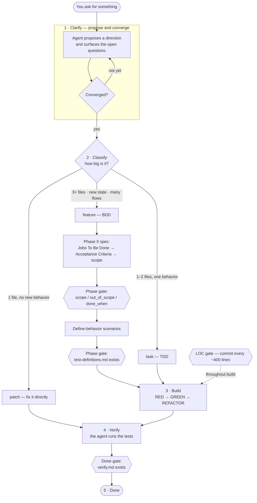

import { Aside } from '@astrojs/starlight/components';

Every safeword session runs through the same five phases, in order. Each phase has an exit you have to meet before the next one starts — and three of those exits are **hard gates** the agent can't talk its way past.

## 1 · Clarify

The agent doesn't ask twenty questions and it doesn't guess. It **proposes a direction**, then surfaces the open questions inside that proposal, and converges with you over as many turns as the ambiguity warrants — a clear request takes zero rounds, a vague idea takes two or three.

For a **feature**, this is also where the product framing gets written, in order: Jobs To Be Done (one persona per job) → Acceptance Criteria → engineering scope. Those scope decisions land in the ticket as `scope`, `out_of_scope`, and `done_when`.

## 2 · Classify

The agent sizes the work — it doesn't announce a label, it just picks the right track:

- **patch** — one file, no real behavior change. Fix it directly.
- **task** — one or two files, one testable behavior. Test-driven.
- **feature** — three or more files, new state, or multiple user flows. Behavior-first.

## 3 · Build

- **patch** goes straight to the fix.
- **task** runs the TDD loop: a failing test (RED), the minimum code to pass (GREEN), then cleanup (REFACTOR).
- **feature** writes define-behavior scenarios first, then implements each one through that same TDD loop.

## 4 · Verify

The agent runs the relevant tests itself after every fix, task, or feature. It never hands you something to test that it could have tested.

## 5 · Done

A ticket can't close until `verify.md` exists in its folder — the artifact the `/verify` skill produces. No artifact, no done.

<Aside type="caution" title="The three gates hard-block">
Safeword runs hooks every turn to track which phase the agent is in. Three of them stop work cold rather than warn:

- **Phase gate** — can't start TDD without `test-definitions.md`; can't write that file without `scope` / `out_of_scope` / `done_when` in the ticket.
- **LOC gate** — commit roughly every 400 lines of project code, so no single change grows an unreviewable blast radius.
- **Done gate** — can't close a ticket without `verify.md`.

</Aside>

<footer class="docs-footer">

[GitHub](https://github.com/TheMostlyGreat/safeword) · MIT License · © 2026

</footer>
